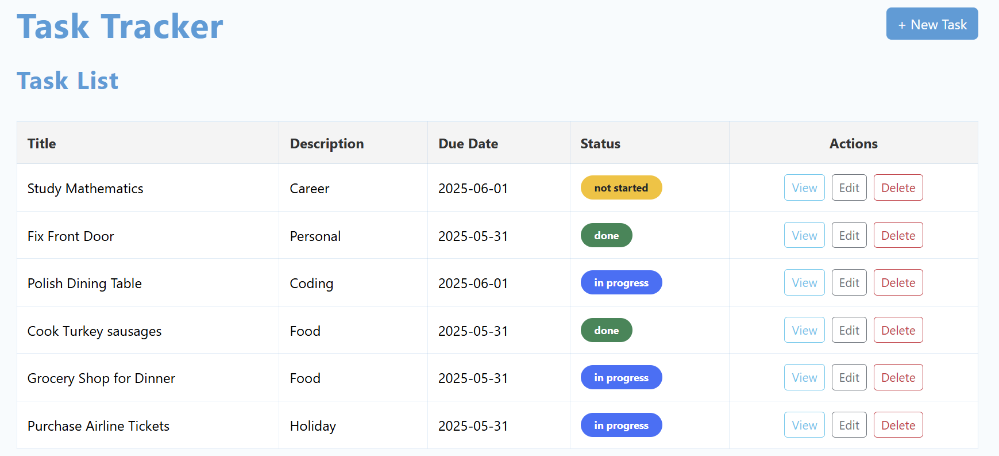
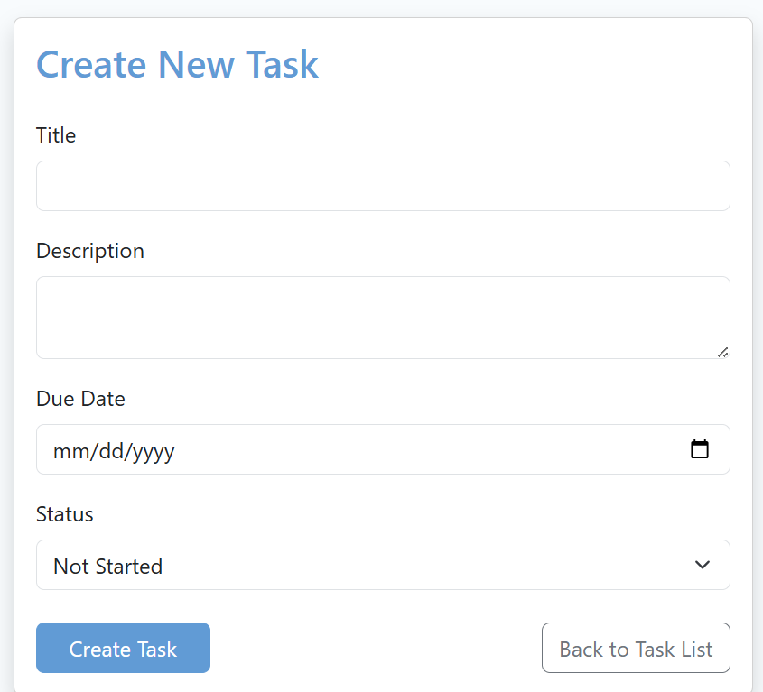
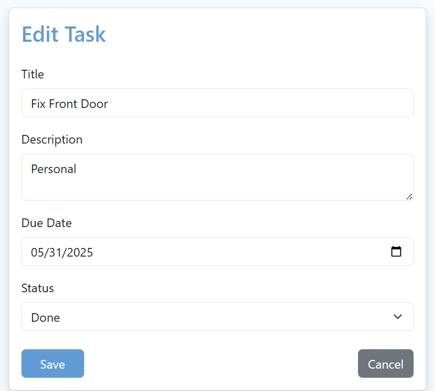
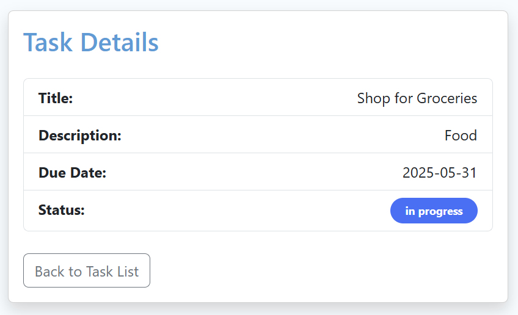

# Task Tracker – Full Stack Angular & Spring Boot Application

A modern, professional task management app with full CRUD functionality, built with:
- **Angular 18** (Bootstrap 5 styling, standalone components, modern routing)
- **Spring Boot** (Java 17, REST API)
- **Responsive UI:** Clean, mobile-friendly, and brandable

---

## ✨ Features

- **Create, View, Update, and Delete Tasks**
- **Beautiful, Modern UI** (Bootstrap + custom brand color)
- **Live Data** – Integrated with a real Java Spring Boot backend (API)
- **Easy Navigation** – Task list, details, create/edit forms
- **Status Highlighting** (color-coded: Not Started, In Progress, Done)
- **Fully Documented Code** – Clean, modular, and professional

---

## 🚀 Demo

**Screenshots:**  
  
  
  
  

---

## 🛠️ Tech Stack

- **Frontend:** Angular 18, Bootstrap 5, TypeScript
- **Backend:** Spring Boot, Java 17, REST API

---

## 📦 How to Run

**Frontend**
```
cd tasktracker-frontend
npm install
npm start
# visit http://localhost:4200
```

**Backend**
```
cd tasktracker-backend
./mvnw spring-boot:run
# REST API runs at http://localhost:8080
```

---

## 💡 Customization
Branding: Change the brand color in src/styles.css (--brand-primary)

Backend API: Adjust src/app/tasks/task.service.ts for your endpoint

---

## 🙋‍♂️ About the Developer
Hi, I'm Femi – a senior Java and full stack developer.
If you’d like a custom project like this (or want this app customized for your business), let’s work together!

---

## 📧 Contact & Fiverr
Fiverr Profile: https://www.fiverr.com/femi_adetula

Email: femi.adetula.services@gmail.com
